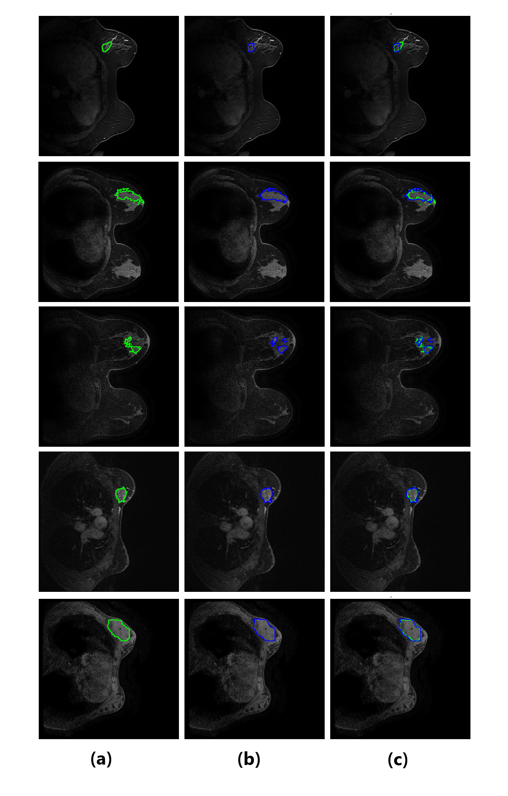

<h1>Localization-Guided Breast Tumor Segmentation in MRI</h1>

<!-- Framework overview -->

  

This repository contains the implementation of a two-stage deep learning pipeline for breast MRI segmentation, combining:

<ul>
  <li><strong>YOLOv11-n nano</strong> for tumor localization</li>
  <li><strong>UNet++, UNet3+, TransUNet, Attention UNet</strong> for semantic segmentation</li>
</ul>

<h2>🚀 Overview of the Two-Stage Pipeline</h2>

<h3>1️⃣ Lesion Localization (YOLOv11-n)</h3>

A lightweight YOLOv11-n model detects suspicious tumor regions on MRI slices.

<h3>2️⃣ Region-Guided Segmentation</h3>

Each detected region-of-interest is extracted and segmented using an advanced segmentation model.
This improves precision and reduces false positives.

<h2>📊 Datasets</h2>

<h3>DUKE Breast MRI Dataset</h3>
<ul>
  <li>251 curated patient studies</li>
  <li>49,236 axial slices (224×224)</li>
  <li>Pixel-level segmentation masks + YOLO bounding boxes</li>
</ul>

<h3>QIN Breast MRI (TCIA)</h3>
<ul>
  <li>Used exclusively for external validation</li>
  <li>76,000+ DICOM images</li>
  <li>Expert-annotated tumor masks</li>
</ul>

<h2>🛠️ Pre-processing Pipeline</h2>

<ol>
  <li>Extract 2D slices from DICOM/NIfTI volumes</li>
  <li>Remove empty slices</li>
  <li>Resize to <strong>224×224</strong></li>
  <li>Normalize intensity to <strong>[0,1]</strong></li>
  <li>Extract segmentation masks</li>
  <li>Generate YOLOv11-n bounding boxes</li>
  <li>Split into train / validation / test sets</li>
</ol>

# 📈 Performance Comparison

| **Approach** | **Model** | **DSC (%)** | **IoU (%)** | **Precision (%)** | **Recall (%)** |
|--------------|-----------|-------------|-------------|--------------------|-----------------|
| **Without Detection** | Attention UNet | 83.49 | 72.07 | 88.71 | 79.31 |
| **Without Detection** | TransUNet | 83.92 | 72.65 | 86.65 | 81.66 |
| **Without Detection** | UNet++ | 87.73 | 78.36 | 86.40 | 89.31 |
| **Without Detection** | **UNet3+** | **88.19** | **79.70** | **91.48** | **89.57** |
| **With Detection** | UNet3+ | 93.49 | 91.78 | **93.49** | 93.90 |
| **With Detection** | Attention UNet | 93.44 | 91.74 | 93.43 | 93.88 |
| **With Detection** | TransUNet | 93.48 | 91.79 | 93.32 | 94.13 |
| **With Detection** | **UNet++** | **93.62** | **91.96** | 93.43 | **94.19** |

---

# 🧪 QIN External Validation (Generalization Test)

Cross-dataset performance of the Duke-trained **UNet++** model on the **QIN Breast MRI** dataset:

| **Metric** | **Value** |
|------------|-----------|
| Accuracy | 99.61% |
| Precision | 96.74% |
| Recall | 96.61% |
| Dice Similarity Coefficient (DSC) | 96.35% |
| Intersection over Union (IoU) | 94.74% |

These results confirm **strong cross-dataset generalization**, despite major differences in MRI acquisition protocols.

---

# 📷 Qualitative Results

### **1️⃣ YOLO Detection Impact**

### **2️⃣ Comparison Across Segmentation Architectures**

### **3️⃣ DUKE Segmentation Results**

### **4️⃣ QIN External Validation**

