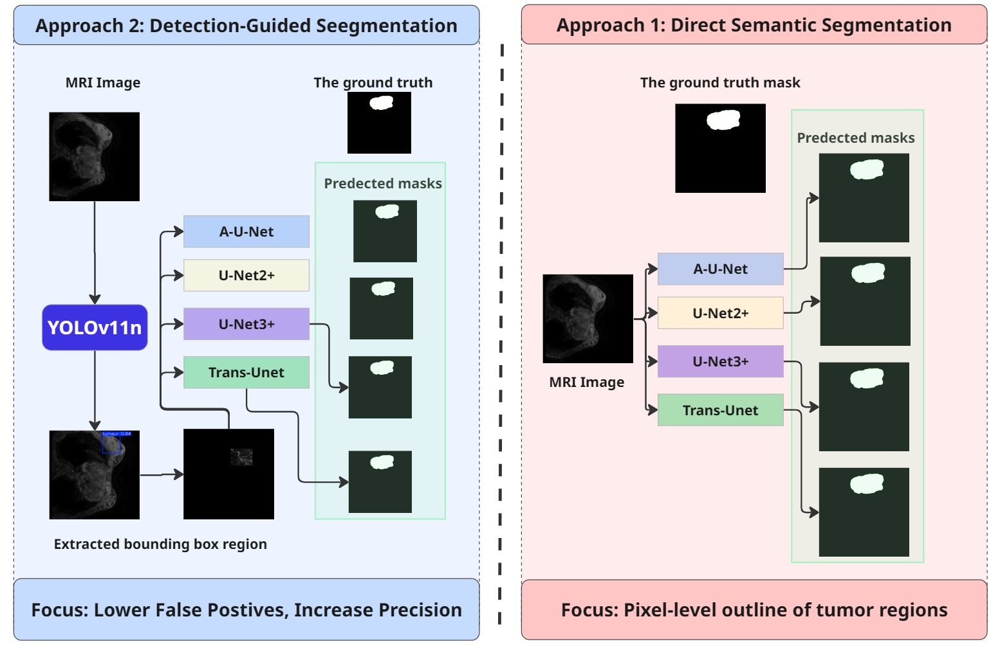
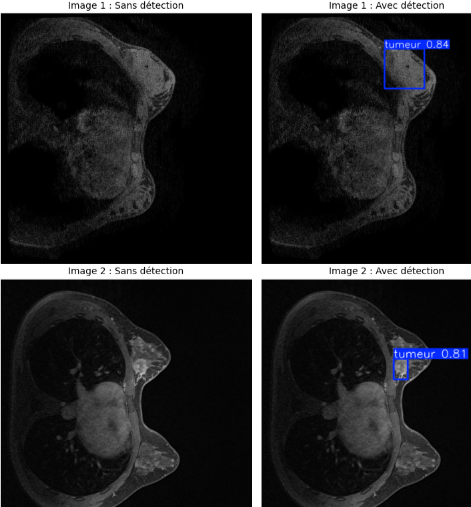

<h1>Localization-Guided Breast Tumor Segmentation in MRI</h1>

  

This repository contains the implementation of a two-stage deep learning framework for breast MRI segmentation, combining:

<ul>
  <li><strong>YOLOv11-n nano</strong> for lesion localization</li>
  <li><strong>UNet++, UNet3+, TransUNet, Attention UNet</strong> for semantic segmentation</li>
</ul>

<h2>🚀 Overview of the Two-Stage Pipeline</h2>

<h3>1️⃣ Lesion Localization (YOLOv11-n)</h3>

A lightweight detector identifies suspicious regions on MRI slices.

<h3>2️⃣ Region-Guided Segmentation</h3>

Detected ROIs are cropped and fed into a segmentation network (UNet++, UNet3+, Attention UNet, TransUNet).
This improves accuracy and reduces false positives.

<h2>📊 Datasets</h2>

<h3>DUKE Breast MRI (MAMA-MIA subset)</h3>
<ul>
  <li>922 patients → 251 curated cases</li>
  <li>3D DCE-MRI volumes</li>
  <li>Converted to <strong>49,236 slices (224×224)</strong></li>
  <li>Pixel-level masks + bounding boxes</li>
</ul>

<h3>QIN Breast MRI (TCIA)</h3>
<ul>
  <li>Used ONLY for external validation</li>
  <li>10 patients × 2 studies</li>
  <li>76,000+ DICOM images</li>
  <li>Expert-drawn tumor masks</li>
</ul>

<h2>🛠️ Pre-processing Pipeline</h2>

<ol>
  <li>Extract 2D slices from NIfTI/DICOM</li>
  <li>Remove empty slices</li>
  <li>Export to PNG</li>
  <li>Resize to <strong>224×224</strong></li>
  <li>Normalize intensities to <strong>[0,1]</strong></li>
  <li>Extract segmentation masks</li>
  <li>Generate YOLO bounding boxes</li>
  <li>Split into train / val / test</li>
</ol>

<h2>📈 Quantitative Results</h2>

The two-stage pipeline significantly improves segmentation accuracy across all architectures.

<!-- TABLE STYLE (Optional) -->

<h3>📊 Performance Comparison Between Approaches</h3>

<table>
  <thead>
    <tr>
      <th>Approach</th>
      <th>Model</th>
      <th>DSC (%)</th>
      <th>IoU (%)</th>
      <th>Precision (%)</th>
      <th>Recall (%)</th>
    </tr>
  </thead>
  <tbody>

    <!-- WITHOUT DETECTION -->
    <tr>
      <td rowspan="4"><strong>Without Detection</strong></td>
      <td>Attention UNet</td>
      <td>83.49</td>
      <td>72.07</td>
      <td>88.71</td>
      <td>79.31</td>
    </tr>
    <tr>
      <td>TransUNet</td>
      <td>83.92</td>
      <td>72.65</td>
      <td>86.65</td>
      <td>81.66</td>
    </tr>
    <tr>
      <td>UNet++</td>
      <td>87.73</td>
      <td>78.36</td>
      <td>86.40</td>
      <td>89.31</td>
    </tr>
    <tr>
      <td><strong>UNet3+</strong></td>
      <td><strong>88.19</strong></td>
      <td><strong>79.70</strong></td>
      <td><strong>91.48</strong></td>
      <td><strong>89.57</strong></td>
    </tr>

    <!-- WITH DETECTION -->
    <tr>
      <td rowspan="4"><strong>With Detection</strong></td>
      <td>UNet3+</td>
      <td>93.49</td>
      <td>91.78</td>
      <td><strong>93.49</strong></td>
      <td>93.90</td>
    </tr>
    <tr>
      <td>Attention UNet</td>
      <td>93.44</td>
      <td>91.74</td>
      <td>93.43</td>
      <td>93.88</td>
    </tr>
    <tr>
      <td>TransUNet</td>
      <td>93.48</td>
      <td>91.79</td>
      <td>93.32</td>
      <td>94.13</td>
    </tr>
    <tr>
      <td><strong>UNet++</strong></td>
      <td><strong>93.62</strong></td>
      <td><strong>91.96</strong></td>
      <td>93.43</td>
      <td><strong>94.19</strong></td>
    </tr>

  </tbody>
</table>

<h2>📷 Qualitative Results</h2>

<h3>1️⃣ DUKE Breast MRI – Segmentation Results</h3>

<h3>2️⃣ Effect of YOLO Detection Before Segmentation</h3>

<h3>3️⃣ Comparison with Multiple Architectures</h3>

<h3>4️⃣ QIN Breast MRI – External Validation</h3>

<h2>📜 Citation</h2>

<pre>
@article{touazi2025breastmri,
  title={Enhancing Breast Tumor Segmentation in MRI Using a Localization-Guided Deep Learning Framework},
  author={Touazi, Fayçal and Gaceb, Djamel and Benzenati, Tayeb and Arioua, Fayçal},
  journal={submitted},
  year={2025}
}
</pre>

<h2>📄 License</h2>

This project is released under the MIT License.

